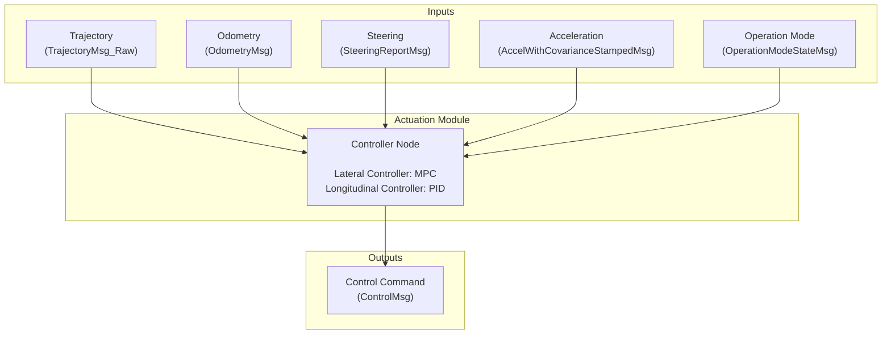

<!--
# Copyright (c) 2021-2026, Arm Limited.
#
# SPDX-License-Identifier: Apache-2.0
-->

# Autoware Safety Island

[](https://autowarefoundation.github.io/autoware-safety-island/)

A standalone Zephyr RTOS application that runs Autoware's trajectory
follower (MPC lateral, PID longitudinal) on an Arm safety-class processor
and exchanges control commands with Autoware over DDS. No changes to the
Autoware codebase are required.

### Workflow



## Main Components

| Component | Version |
|--------------|---------------|
| Zephyr RTOS  | [3.6.0](https://github.com/zephyrproject-rtos/zephyr/commit/6aeb7a2b96c2b212a34f00c0ad3862ac19e826e8) |
| CycloneDDS  | [0.11.x](https://github.com/eclipse-cyclonedds/cyclonedds/commit/7c253ad3c4461b10dc4cac36a257b097802cd043) |
| Autoware    | [2025.02](https://github.com/autowarefoundation/autoware/tree/2025.02) |
| Autoware.Universe | [0.40.0](https://github.com/autowarefoundation/autoware.universe/tree/0.40.0) |
| Autoware.msgs | [1.3.0](https://github.com/autowarefoundation/autoware_msgs/tree/1.3.0) |

## Autoware Components

| Component | Description |
|-----------|---------|
| autoware_msgs | Autoware Messages |
| autoware_osqp_interface | OSQP Interface |
| autoware_universe_utils | Universe Utils |
| autoware_motion_utils | Motion Utils |
| autoware_interpolation | Interpolation Utils |
| autoware_vehicle_info_utils | Vehicle Info Utils |
| autoware_trajectory_follower_base | Trajectory Follower Base |
| autoware_mpc_lateral_controller | MPC Lateral Controller |
| autoware_pid_longitudinal_controller | PID Longitudinal Controller |
| autoware_trajectory_follower_node | Trajectory Follower Node |

## Getting Started

See the [documentation](https://autowarefoundation.github.io/autoware-safety-island/) — the [Quickstart](https://autowarefoundation.github.io/autoware-safety-island/user_guide/quickstart.html) builds and runs the FVP target in a few commands.

## Verification target: FreeRTOS POSIX simulator (Phase 2)

The Phase 2 vendored-upstream architecture (issue #14) targets a FreeRTOS POSIX
simulator (FreeRTOS-Kernel V11.1.0, POSIX port, 64-bit native Linux) on top of
which the actuation controller runs against vendored, untouched copies of
`autoware.universe` 0.40.0 and `autoware_msgs` 1.3.0. The existing Zephyr/FVP
target above remains and evolves separately under issue #1.

Layout introduced for Phase 2:

```
external/
  FreeRTOS-Kernel/        @ V11.1.0 (POSIX port)
  autoware_universe/      @ 0.40.0  (untouched)
  autoware_msgs/          @ 1.3.0   (untouched)
  rosidl/                 @ humble  (standalone message generator)
  micro_ros/              (rcl/rclc/rmw_microxrcedds/rcutils/rmw/micro-CDR/Micro-XRCE-DDS-Client)

freertos/                 FreeRTOS POSIX entry + CMake build root
shim/rclcpp/              Minimal rclcpp:: facade over rcl/rclc
shim/stubs/               Header stubs for pruned upstream-isms (tf2, diagnostic_updater, …)
cmake/                    AutowarePackageCompat, MicroRosMessages, MicroRos, AddAutowarePackage
host_tests/               Catch2 host tests covering the rclcpp facade
scripts/                  install-rosidl-host.sh, run_rosidl_generator.py
```

Quickstart (host tooling — runs the rclcpp facade test suite):

```bash
git submodule update --init --recursive
./scripts/install-rosidl-host.sh
cmake -S host_tests -B build/host_tests
cmake --build build/host_tests
ctest --test-dir build/host_tests --output-on-failure
```

FreeRTOS POSIX scaffold + micro-CDR transport layer:

```bash
cmake -S freertos -B build/freertos
cmake --build build/freertos --target hello_freertos microcdr
./build/freertos/hello_freertos   # prints "hello freertos" from a FreeRTOS task
```

Standalone message generation smoke test (verifies the rosidl pipeline):

```bash
./cmake/test/test_message_gen.sh   # generates autoware_common_msgs/{.h,.hpp}
```

> All `external/autoware_universe` and `external/autoware_msgs` packages above
> are consumed untouched (git diff inside vendored sources is zero lines). The
> Zephyr build still uses the in-tree copies under `actuation_module/src/autoware/`
> until issue #1's PAL work migrates it to the same path.
